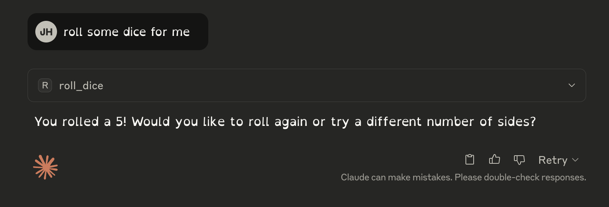

MCP TanStack Example

# Getting Started

To run this application:

```bash
pnpm i
pnpm dev
```

```json
"remote-example": {
  "command": "npx",
  "args": [
    "mcp-remote",
    "http://localhost:3000/api/sse"
  ]
}
```

Vercel uses [the same Transport as this](https://github.com/vercel/mcp-adapter/blob/main/src/next/mcp-api-handler.ts#L403-L404).

No problems using `mcp-remote` in Claude:


